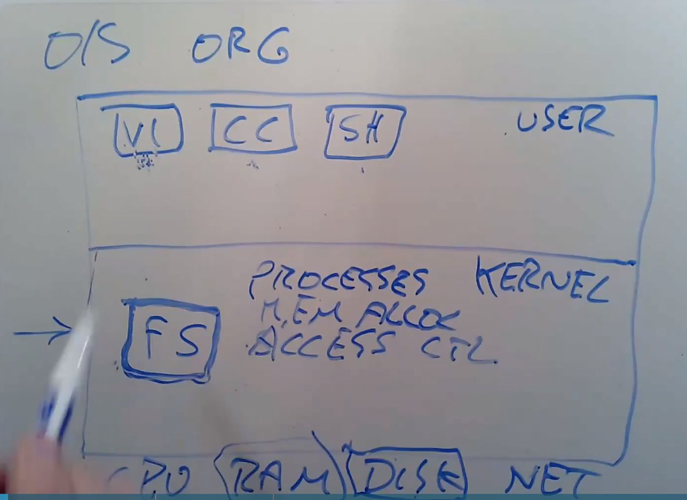

# Introduction of OS

## 1. 操作系统的目的

1.1 硬件抽象化

1.2 硬件复用

1.3 程序之间的隔离

1.4 程序之间的共享

1.5 访问控制系统

1.6 保证较高性能

1.7 支持一系列不同的用途

## 2. 操作系统结构



## 3. 内核代码

内核代码享有优先权，它会一直存在系统中，普通函数必须调用内核函数才能访问底层资源

## 4. 课程硬件

操作系统：xv6

微处理器：RISC-V

机器模拟器：QEMU

## 5. Unix系统调用简介
### 5.1 System call

### 5.2 fork函数
[百度百科fork函数](https://baike.baidu.com/item/fork/7143171?fr=aladdin)

由于在复制时复制了父进程的堆栈段，所以两个进程都停留在fork函数中，等待返回。因此fork函数会返回两次，一次是在父进程中返回，另一次是在子进程中返回，这两次的返回值是不一样的。

ork调用的一个奇妙之处就是它仅仅被调用一次，却能够返回两次，它可能有三种不同的返回值：

(1)在父进程中，fork返回新创建子进程的进程ID；

(2)在子进程中，fork返回0；

(3)如果出现错误，fork返回一个负值。

示例代码：
```
#include<unistd.h>
#include<stdio.h>
#include<stdlib.h>
int main(int argc,char *argv[]){
    pid_t pid=fork();
    if ( pid < 0 ) {
        fprintf(stderr,"错误！");
    } else if( pid == 0 ) {
        printf("子进程空间");
        exit(0);
    } else {
        printf("父进程空间，子进程pid为%d",pid);
    }
    // 可以使用wait或waitpid函数等待子进程的结束并获取结束状态
    exit(0);
}
```
### 5.3 虚拟内存
[百度百科虚拟内存](https://baike.baidu.com/item/%E8%99%9A%E6%8B%9F%E5%86%85%E5%AD%98/101812?fr=aladdin)

虚拟内存别称虚拟存储器（Virtual Memory）。电脑中所运行的程序均需经由内存执行，若执行的程序占用内存很大或很多，则会导致内存消耗殆尽。为解决该问题，OS 中运用了虚拟内存技术，即匀出一部分硬盘空间来充当内存使用。当内存耗尽时，电脑就会自动调用硬盘来充当内存，以缓解内存的紧张。若计算机运行程序或操作所需的随机存储器(RAM)不足时，则 OS 会用虚拟存储器进行补偿。它将计算机的RAM和硬盘上的临时空间组合。当RAM运行速率缓慢时，它便将数据从RAM移动到称为“分页文件”的空间中。将数据移入分页文件可释放RAM，以便完成工作。 一般而言，计算机的RAM容量越大，程序运行得越快。若计算机的速率由于RAM可用空间匮乏而减缓，则可尝试通过增加虚拟内存来进行补偿。

虚拟内存在Linux系统中以名为swap的文件出现，一般会隐藏。

### 5.4 cache命中率与访问时间
[CSDN cache命中率](https://blog.csdn.net/weixin_43914272/article/details/108212718)

命中率越高越好，未命中又需要向下继续搜索，使得访问时间更长

### 5.5 BIOS
BIOS是一段计算机启动时运行的代码，它可以开启操作系统

### 5.6 磁盘管理
[CSCN block与inode](https://blog.csdn.net/weixin_46199479/article/details/123602750)

## 6. 实验

### 6.1 操作系统源码中的int argc和char * argv[]
argc: 整数,用来统计你运行程序时送给main函数的命令行参数的个数
*argv[]: 指针数组，用来存放指向你的字符串参数的指针，每一个元素指向一个参数
argv[0] 指向程序运行的全路径名
argv[1] 指向在DOS命令行中执行程序名后的第一个字符串
argv[2] 指向执行程序名后的第二个字符串
argv[argc]为NULL。
示例如图：


### 6.2 文件描述符
[百度百科 文件描述符](https://baike.baidu.com/item/%E6%96%87%E4%BB%B6%E6%8F%8F%E8%BF%B0%E7%AC%A6/9809582?fr=aladdin)

### 6.3 sleep实验
```
int 
main(int argc, char *argv[])
{
    if(argc < 2){
        printf(2, "Usage: sleep time...\n");
    }
    else if (argc > 2){
        printf(2, "Usage: only one arguement\n");
    }
    else{
        int timeLen;
        timeLen = atoi(argv[1]);
        if(sleep(timeLen) < 0){
            printf(2, "sleep %n failed", timeLen);
        }
    }
    exit();
}
```

### 6.3 pingpong实验
关键在于确定子进程和父进程各自需要关心两个pipe的哪一端，把需要的那一端的文件描述符留下，不需要的close掉。<font color=#FF0000, font size=4>也就是说，如果当前进程要读该管道，就需要关闭该管道的写端，反之也是如此；并且进程的读写任务全部完成后，要关闭使用过的端</font>。

代码：
```
#define RD 0 //pipe的read端
#define WR 1 //pipe的write端

int main(int argc, char const *argv[]) {
    char buf = 'P'; //用于传送的字节

    int fd_c2p[2]; //子进程->父进程
    int fd_p2c[2]; //父进程->子进程
    pipe(fd_c2p);
    pipe(fd_p2c);

    int pid = fork();
    int exit_status = 0;

    if (pid < 0) {
        fprintf(2, "fork() error!\n");
        close(fd_c2p[RD]);
        close(fd_c2p[WR]);
        close(fd_p2c[RD]);
        close(fd_p2c[WR]);
        exit(1);
    } else if (pid == 0) { //子进程
        /*
        如果当前进程要读该管道，就需要关闭该管道的写端，反之也是如此
        */
        close(fd_p2c[WR]);  
        close(fd_c2p[RD]);

        if (read(fd_p2c[RD], &buf, sizeof(char)) != sizeof(char)) {
            fprintf(2, "child read() error!\n");
            exit_status = 1; //标记出错
        } else {
            fprintf(1, "%d: received ping\n", getpid());
        }

        if (write(fd_c2p[WR], &buf, sizeof(char)) != sizeof(char)) {
            fprintf(2, "child write() error!\n");
            exit_status = 1;
        }

        close(fd_p2c[RD]);
        close(fd_c2p[WR]);

        exit(exit_status);
    } else { //父进程
        close(fd_p2c[RD]);
        close(fd_c2p[WR]);

        if (write(fd_p2c[WR], &buf, sizeof(char)) != sizeof(char)) {
            fprintf(2, "parent write() error!\n");
            exit_status = 1;
        }

        if (read(fd_c2p[RD], &buf, sizeof(char)) != sizeof(char)) {
            fprintf(2, "parent read() error!\n");
            exit_status = 1; //标记出错
        } else {
            fprintf(1, "%d: received pong\n", getpid());
        }

        close(fd_p2c[WR]);
        close(fd_c2p[RD]);

        exit(exit_status);
    }
}
```

### 6.4 primes实验
实验关键在于用fork创建新进程，以及借助pipe来完成read和write，这些过程呈现递归形式。

代码：
```
#include "types.h"
#include "stat.h"
#include "user.h"
#define RD 0
#define WR 1

void primes(int *p_pre)
{
    int p_next[2];
    int first_rece;
    pipe(p_next);
    close(p_pre[WR]);
    
    if(read(p_pre[RD], &first_rece, sizeof(int)) == 0){
        close(p_pre[RD]);
        exit();
    }
    else{
        printf(1, "prime %d\n", first_rece);
        int pid = fork();  // create next pipe
        if(pid < 0){  
            printf(2, "ERROR: fork failed \n");
            exit();
        }
        else if(pid == 0){
            close(p_pre[RD]);
            primes(p_next);
            exit();
        }
        else{
            close(p_next[RD]);
            int rece_data;
            while(1){
                if(read(p_pre[RD], &rece_data, sizeof(int)) == 0){
                    break;
                }else{
                    if(rece_data % first_rece != 0){
                        if(write(p_next[WR], &rece_data, sizeof(int)) < sizeof(int)){
                            printf(2, "ERROR: write failed \n");
                        }
                    }
                }
            }
            close(p_pre[RD]);
            close(p_next[WR]);
            wait();
            exit();
        }
    }
}

int main(int argc, char *argv[])
{
    int p[2];  

    pipe(p);
    int pid = fork();
    if(pid < 0){
        printf(2, "ERROR: pipe failed \n");
        exit();
    }
    else if(pid == 0){  // child process
        primes(p);
        exit();
    }
    else{               // parent process
        close(p[RD]);
        for(int i = 2; i <= 35; i++){
            if(write(p[WR], &i, sizeof(int)) < sizeof(int)){
                printf(2, "ERROR: write() failed \n");
            }
        }
        close(p[WR]);
        wait();
        exit();
    }
}
```

### 6.5 find实验
文件系统：每一个文件可以有多个文件名（也可以说是硬链接），但是它在inode中只有一个编号。

fstat系统调用从文件描述符引用的inode中检索信息。它的结构为：
```
struct stat {
  short type;  // Type of file
  int dev;     // File system's disk device
  uint ino;    // Inode number
  short nlink; // Number of links to file
  uint size;   // Size of file in bytes
};
```

dirent记录文件夹目录内容，可以通过read和dirent配合来获取文件夹的目录内容：
```
struct dirent {
  ushort inum;
  char name[DIRSIZ];
};
struct dirent de;
while(read(path_fd, &de, sizeof(de)) == sizeof(de)){
    if(de.inum == 0)
        continue;
    memmove(p, de.name, DIRSIZ);
}
```

find实验代码与ls.c非常相似，只是改动了fmtname函数，以及核心逻辑改为递归搜索而已：
```
#include "types.h"
#include "stat.h"
#include "user.h"
#include "fs.h"

char*
fmtname(char *path)
{
  char *p;

  // Find first character after last slash.
  for(p=path+strlen(path); p >= path && *p != '/'; p--)
    ;
  p++;
  return p;
}

void find(char *path, char *file)
{
    char buf[512], *p;
    int path_fd;
    struct dirent de;
    struct stat path_st;

    // check variable path
    if((path_fd = open(path, 0)) < 0){
        printf(2, "find: cannot open %s\n", path);
        return;
    }
    if(fstat(path_fd, &path_st) < 0){  // put the fd's file info into &st
        printf(2, "find: cannot stat %s\n", path);
        close(path_fd);
        return;
    }
    if(path_st.type != T_DIR){  // path must be a path
        printf(2, "ERROR: %s is not path \n", path);
        close(path_fd);
        return;
    }

    // start ls
    if(strlen(path) + 1 + DIRSIZ + 1 > sizeof buf){
      printf(2, "find: path too long\n");
    }
    strcpy(buf, path);
    p = buf+strlen(buf);
    *p++ = '/';
    while(read(path_fd, &de, sizeof(de)) == sizeof(de)){
        if((de.inum == 0) || (strcmp(de.name, ".") == 0) || 
        (strcmp(de.name, "..") == 0))
          continue;
        memmove(p, de.name, DIRSIZ);
        p[DIRSIZ] = 0;
        if(stat(buf, &path_st) < 0){
          printf(1, "find: cannot stat %s\n", buf);
          continue;
        }

        char *path_file = fmtname(buf);
        if((path_st.type == T_FILE) && 
        (strcmp(path_file, file) == 0)){
            printf(1, "%s \n", buf);
        }
        if(path_st.type == T_DIR){
            find(buf, file);
        }
    }
    close(path_fd);
}

int main(int argc, char *argv[])
{
    if(argc != 3){
        printf(2, "Usage: find path file...");
        exit();
    }
    else{
        find(argv[1], argv[2]);
        exit();
    }
}
```
