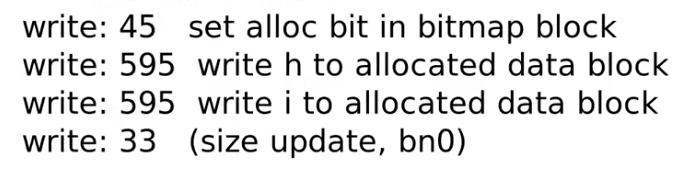

# File System

## 1. file system 概述

### 1.1 file system 先验知识
- 硬盘上0.5kb为一个扇区（sector），8个扇区组成一个块（block），所以一个block大小为4kb；
- 一个文件可能占用多个块；
- 每个文件有一个inode，inode记录该文件的各类信息，包括文件的字节数，块数，文件的读、写、执行权限，文件的时间戳，文件数据block的位置，inode编号等。

### 1.2 file system 架构 
]

xv6文件系统的实现分为七层，如上图示：
- disk层在virtio磁盘上读写块；
- Buffer cache缓存磁盘块，并同步访问它们，确保一个块只能同时被内核中的一个进程访问；
- Logging层允许上层通过事务更新多个磁盘块，并确保在崩溃时，磁盘块是原子更新的（即全部更新或不更新）；
- inode层将一个文件都表示为一个inode，每个文件包含一个唯一的i-number和一些存放文件数据的块，每个文件的inode中存储着该文件的各种信息；
- 目录层将实现了一种特殊的inode，被称为目录，其包含一个目录项序列，每个目录项由文件名称和i-number组成；
- 路径名层提供了层次化的路径名，可以用递归查找解析他们；
- 文件描述符层用文件系统接口抽象了许多Unix资源（如管道、设备、文件等），使程序员的生产力得到大大的提高。

我们可以将磁盘看作是一个巨大的block的数组，数组从0开始，一直增长到磁盘的最后。xv6将磁盘分为几个部分，如上图所示。
- 文件系统不会使用块0（它存放boot sector）；
- 第1块称为superblock，它包含了文件系统的元数据（以块为单位的文件系统大小、数据块的数量、inode的数量和日志中的块数），superblock由一个单独的程序mkfs写入，它建立了一个初始文件系统；
- 从块2开始存放着log；
- log之后是inodes，每个块会包含多个inode（每个文件包含一个唯一的inode）；
- 在这些块之后是位图块（bitmap），记录哪些block在使用，一个文件可能占用多个block；
- 其余的块是数据块，每个数据块要么在bitmap块中标记为空闲，要么持有文件或目录的内容。

## 2. file system 各层情况

### 2.1 buffer cache层
buffer缓存有两项工作：
1. 同步访问磁盘块，以确保磁盘block在内存中只有一个buffer缓存，并且一次只有一个内核线程能使用该buffer缓存；
2. 缓存使用较多的块，这样它们就不需要从慢速磁盘中重新读取。

block cache的特性：
- 首先，在内存中，对于一个block只能有一份缓存，这是block cache必须维护的特性；
- 第二，它采用了LRU作为block cache替换策略；
- 第三，它有两层锁：第一层锁用来保护buffer cache的内部数据，保证只有一个进程对buffer cache进行扫描与修改；第二层锁也就是sleep lock用来保护单个block的cache，它确保了任何时候只有一个进程可以读写这个block cache。

### 2.2 logging 层
创建文件最基本的步骤是：
1. 分配inode，或者在磁盘上将inode标记为已分配；
2. 之后更新包含了新文件的目录的data block。

具体步骤如上图，如果在这个过程发生了crash/数据丢失/数据错误等问题，文件属性会被破坏，例如丢失inode（line 3~6），block被多个文件占用（line 8~9）等。

Xv6通过简单的日志系统来解决文件系统操作过程中崩溃带来的问题，日志贮存在磁盘上的一个固定位置。其执行过程如下：
1. log write。当需要更新文件系统时，我们并不是更新文件系统本身。（假设我们在内存中缓存了bitmap block，也就是block 45。当需要更新bitmap时，我们并不是直接写block 45，而是将数据写入到log中，并记录这个更新应该写入到block 45，对于所有的写 block都会有相同的操作。）所以基本上，任何一次写操作我们并不是直接写入到block所在的位置，而总是先将写操作写入到log中；

2. commit op。之后在某个时间，当文件系统的操作结束了，比如说我们前一节看到的4-5个写block操作都结束，并且都存在于log中，我们会commit文件系统的操作。这意味着我们需要在log的某个位置记录属于同一个文件系统的操作的个数；
3. install log。当我们在log中存储了所有写block的内容时，如果我们要真正执行这些操作，只需要将block数据从log分区移到文件系统分区。我们知道第一个操作该写入到block 45，我们会直接将数据从log写到block45，依次类推；
4. clean log。一旦完成了，就可以清除log。清除log实际上就是将属于同一个文件系统的操作的个数设置为0。

所以日志可以从处理两种情况：   
- 在重启的时候，文件系统会查看log的commit记录值，如果是0的话，那么什么也不做；
- 如果大于0的话，我们就知道log中存储的block需要被写入到文件系统中，在crash的时候并不一定完成了install log，所以这个时候我们需要做的就是将log中的block再次写入到文件系统，再clean log。                  

不管是哪种情况，日志都会使写与崩溃为原子形式的：即恢复后，所有操作的写入内容，要么都在磁盘上，要么都不在。

此外，logging系统需要遵循的两条原则：
1. write ahead rule。任何时候如果一堆写操作需要具备原子性，系统需要先将所有的写操作记录在log中，之后才能将这些写操作应用到文件系统的实际位置；
2. freeing rule。操作系统对于不同的系统调用复用的是同一段log空间，但是直到log中所有的写操作被更新到文件系统之前，我们都不能释放或者重用log。

### 2.3 inode 层
磁盘和内存上都有inode，所以inode有两种相关含义：
1. 指的是磁盘上的数据结构，其中包含了文件的大小和数据块号的列表；
2. 指的是内存中的inode，它包含了磁盘上inode的副本以及内核中需要的其他信息。
   
磁盘上的inode结构体包含以下信息：
- type字段区分了文件、目录和特殊文件（设备），type为0表示该inode是空闲的；
- nlink字段统计引用这个inode的目录项的数量，当nlink为0时，就释放磁盘上的inode及其数据块（硬链接就是直接指向文件的inode，而软链接指向文件名）；
- size字段记录了文件中内容的字节数；
- addrs数组记录了持有文件内容的磁盘块的块号。

内存上的inode：
内核将磁盘上正在使用的inode保存在内存中，内存上结构体inode是磁盘上inode结构体的拷贝。内核只在有指针指向inode才会储存，ref字段为指向inode的指针的数量，如果引用数量减少到零，说明该inode变成空闲状态，内核就会从内存中丢弃这个inode。

### 2.4 directory 层
目录的实现机制和文件很类似。它的inode类型是T_DIR，它的数据是一个目录项的序列。

每一个目录包含了directory entries，每一条entry都有固定的格式：
- 前2个字节包含了目录中文件或者子目录的inode编号；
- 接下来的14个字节包含了文件或者子目录名。

假设我们要查找路径名“/y/x”，那么过程是这样的：
1. 应该从root inode开始查找，扫描root inode包含的所有block，以找到“y”；
2. 如果找到了，那么目录y也会有一个inode编号，我们可以继续从y的inode查找：先读取y的inode的内容，之后再扫描inode所有对应的block，找到“x”并得到文件x对应的inode编号；
3. 最后将x的inode编号作为路径名查找的结果返回。

### 2.5 File descriptor 层
Unix中的大部分资源都是以文件的形式来表示的，包括控制台、管道等设备，当然还有真实的文件。文件描述符层就是实现这种统一性的一层。

Xv6给每个进程提供了自己的打开文件表，或者说文件描述符表，它的特点如下：
- 每个打开的文件由一个结构体file表示，它包装inode或管道，也包含一个I/O偏移量。每次调用open都会创建一个新的打开文件（一个新的结构体file），如果多个进程独立打开同一个文件，那么不同的file实例会有不同的I/O偏移量。
- 另一方面，一个打开的文件（同一个结构文件）可以在一个进程的文件表中出现多次，也可以在多个进程的文件表中出现。如果一个进程使用open打开文件，然后使用dup创建别名，或者使用fork与子进程共享文件，就会出现这种情况。
- 引用计数可以跟踪特定打开文件的引用数量。一个文件的打开方式可以为读，写，或者读写，通过readable和writable来指明。

### 2.6 创建一个文件的过程
1. create函数中首先会解析路径名并找到最后一个目录，之后会查看文件是否存在，如果存在的话会返回错误；
2. 之后就会调用ialloc（inode allocate），这个函数会为文件x分配一个空闲的inode：它会遍历所有可能的inode编号找到inode所在的block，再看位于block中的inode数据的type字段，如果这是一个空闲的inode，那么将其type字段设置为文件，这会将inode标记为已被分配；
3. 将数据写入block中。

如下图所示：

## 3. ext3文件系统
### 3.1 ext3与xv6文件系统的异同：
ext3和之前的系统有类似的部分，例如：
- 在磁盘上，与XV6一样会有一个文件系统树，包含了inode，目录，文件等等；
- 会有bitmap block来表明每个data block是被分配的还是空闲的；
- 在磁盘的一个指定区域，会保存log。

ext3与之前xv6文件系统主要的区别在于：ext3可以同时跟踪多个在不同执行阶段的transaction。

### 3.2 ext3的log
ext3的log与XV6中的log有点不一样：
- 在log的最开始，是super block（这是log的super block，而不是文件系统的super block）。log的super block包含了log中第一个有效的transaction的起始位置和序列号。起始位置就是磁盘上log分区的block编号，序列号就是每个transaction都有的序列号。
  
- log是磁盘上一段固定大小的连续的block。log中，除了super block以外的block存储了transaction。每个transaction在log中包含了：
    - 一个descriptor block，其中包含了log数据对应的实际block编号，这与XV6中的header block很像；
    - 之后是针对每一个block编号的更新数据；
    - 最后当一个transaction完成并commit了，会有一个commit block。

因为log中可能有多个transaction，commit block之后可能会跟着下一个transaction的descriptor block，data block和commit block。为了将descriptor block和commit block与data block区分开，descriptor block和commit block会以一个32bit的魔法数字作为起始，这个魔法数字不太可能出现在数据中，并且可以帮助恢复软件区分不同的block。

注意：不同transaction的write log、commit、install和clean都不是一起的，而是分开的。

### 3.3 ext3提高性能
ext3通过3种方式提升了性能：
- 首先，它提供了异步的（asynchronous）系统调用，也就是说系统调用在写入到磁盘之前就返回了，系统调用只会更新缓存在内存中的block，并不用等待写磁盘操作。不过它可能会等待读磁盘；
- 第二，它提供了批量执行（batching）的能力，可以将多个系统调用打包成一个transaction；
- 最后，它提供了并发（concurrency），它允许多个系统调用同时执行，允许多个不同状态的transaction同时存在。

第一，ext3的异步系统调用：

异步处理与同步处理相对，异步处理不用阻塞当前线程来等待处理完成，而是允许后续操作，直至其它线程将处理完成，并回调通知此线程。异步的系统调用修改完位于缓存中的block之后就返回，并不会触发写磁盘。与此同时文件系统在后台会并行的完成之前的系统调用所要求的写磁盘操作，这实现了I/O concurrency。

所以异步系统调用的第一个优势是系统调用能够快速的返回，第二个优势是它使得大量的批量执行变得容易。

第二，ext3的批量执行（batching）：

在任何时候，ext3只会有一个open transaction。ext3中的一个transaction可以包含多个不同的系统调用。

所以ext3是这么工作的：它首先会宣告要开始一个新的transaction，接下来的几秒所有的系统调用都是这个大的transaction的一部分。我认为默认情况下，ext3每5秒钟都会创建一个新的transaction，所以每个transaction都会包含5秒钟内的系统调用，这些系统调用都打包在一个transaction中。在5秒钟结束的时候，ext3会commit这个包含了可能有数百个更新的大transaction。

批量执行的优势：
- 第一，它在多个系统调用之间分摊了transaction带来的固有的损耗。固有的损耗包括写transaction的descriptor block和commit block，现在只需要对一批系统调用执行一次；
  
- 第二，它可以更容易触发write absorption。经常会有这样的情况，你有一堆系统调用最终在反复更新相同的一组磁盘block。通过batching，多次更新同一组block会先快速的在内存的block cache中完成，之后在transaction结束时，一次性的写入磁盘的log中。这被称为write absorption，它可以极大的减少写磁盘的总时间。
- 第三，disk scheduling。假设我们要向磁盘写1000个block，一次性的向磁盘的连续位置写入1000个block，要比分1000次每次写一个不同位置的磁盘block快得多。通过向磁盘提交大批量的写操作，可以更加的高效。

第三，ext3的并发（concurrency）：

ext3包括两种并发：

- 首先ext3允许多个系统调用同时执行，所以我们可以有并行执行的多个不同的系统调用。在ext3决定关闭并commit当前的这个transaction之前，系统调用不必等待其他的系统调用完成，它可以直接修改作为transaction一部分的block；
  
- 其次，ext3提供的并发是可以有多个不同状态的transaction同时存在。所以尽管只有一个open transaction可以接收系统调用，但是其他之前的transaction可以并行的写磁盘。
  
### 3.4 transaction commit步骤
下面是commit transaction涉及到的步骤：
1. 首先需要阻止新的系统调用；
   
2. 需要等待包含在transaction中的已经开始了的系统调用们结束；
3. 一旦transaction中的所有系统调用都完成了，也就是完成了更新cache中的数据，那么就可以开始一个新的transaction，并且让在第一步中等待的系统调用继续执行；
4. 接下来我们可以更新descriptor block，其中包含了所有在transaction中被修改了的block编号；
5. 我们还需要将被修改了的block，从缓存中写入到磁盘的log中；
6. 接下来，我们需要等待前两步中的写log结束；
7. 之后我们可以写入commit block；
8. 结束commit block之后，可以将transaction包含的block写入到文件系统中的实际位置；
9. 在所有写操作完成之后，我们才能重用transaction对应的那部分log空间。

注意，log的存储是环形的，也就是说前面的transaction释放后，后面来的transaction就会占用前面的log空间，如下图所示：

