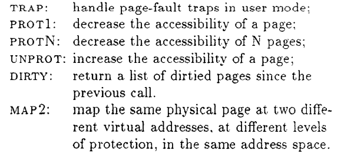
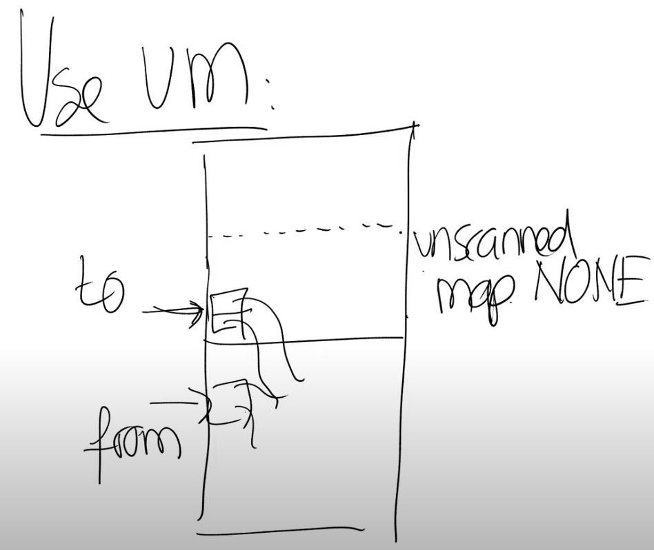

# virtual memory for applications
## 1. 应用程序使用虚拟内存所需特性
需要使用vm的应用程序都依赖虚拟内存的一些特性来正常工作，这些应用程序例如Garbage Collector，Data Compression Application，Shared Virtual Memory等，只有支持一些特性才能运行这些应用程序（这里所指的应用程序是指用户态，与内核态相对而言）。这些特性具体指的是：
1. 第一个特性是Trap。你需要trap来使得发生在内核中的Page Fault可以传播到用户空间，然后在用户空间的handler可以处理相应的Page Fault，之后再以正常的方式返回到内核并恢复指令的执行。这个特性是必须的，否则的话，你不能基于Page Fault做任何事情；
2. 第二个特性是Prot1，它会降低了一个内存Page的accessability。accessability的意思是指内存Page的读写权限。内存Page的accessability有不同的降低方式，例如，将一个可以读写的Page变成只读的，或者将一个只读的Page变成完全没有权限；
3. 第三个特性是管理多个Page的ProtN。ProtN基本上等效于调用N次Prot1，以提升性能；
4. 第四个特性是Unprot，它增加了内存Page的accessability，例如将本来只读的Page变成可读可写的；
5. 第五个特性是能够查看内存Page是否是Dirty；
6. 最后一个特性是map2。map2使得一个应用程序可以将一个特定的内存地址空间映射两次，并且这两次映射拥有不同的accessability。

prot和map等术语的具体解释如下：

## 2. 支持应用程序使用虚拟内存的系统调用
支持应用程序使用虚拟内存的系统调用有：
- mmap。通过mmap系统调用，可以将文件描述符指向的文件内容，从起始位置加上offset的地方开始，映射到特定的内存地址，并且连续映射len长度。这使得你可以实现内存映射文件（见第6章3.5），你可以将文件的内容带到内存地址空间，进而只需要方便的通过普通的指针操作，而不用调用read/write系统调用，就可以从磁盘读写文件内容；
- 对应mmap还有一个munmap系统调用，它使得你可以移除一个地址或者一段内存地址的映射关系；
- mprotect系统调用。当你将某个对象映射到了虚拟内存地址空间，你可以修改对应虚拟内存的权限，这样你就可以以特定的权限保护对象的一部分，或者整个对象；
- sigaction系统调用。它本质上是用来处理signal，它使得应用程序可以设置好一旦特定的signal发生了，就调用特定的函数。

## 3. 虚拟内存如何支持用户应用程序
1. 除了page table外，地址空间还包含了一些操作系统的数据结构，这些数据结构与任何硬件设计都无关，它们被称为Virtual Memory Areas（VMAs），VMA会记录一些有关连续虚拟内存地址段的信息；
   
2. User level trap的实现。我们假设一个PTE被标记成invalid或者只读，而你想要向它写入数据。这时，CPU会跳转到kernel中的固定程序地址（也就是XV6中的trampoline代码）。kernel会保存应用程序的状态（在XV6中是保存到trapframe）。之后再向虚拟内存系统查询，虚拟内存系统或许会做点什么，例如在lazy lab和copy-on-write lab中，trap handler会查看Page Table数据结构，而在这里会查看VMA，并查看需要做什么。

## 4. 虚拟内存应用示例
假设有一个应用，这个应用里是构建一个大的缓存表，它是用来记录一些运算结果的表单。举个例子，你可以这么想，下面是我们的表单，它从0开始到n。表单记录的是一些费时的函数运算的结果，函数的参数就是0到n之间的数字。这里的挑战是，表单可能会很大，或许会大过物理内存，这里可以使用虚拟内存特性来解决这个挑战。

1. 首先，你需要分配一个大的虚拟地址段，但是并不分配任何物理内存到这个虚拟地址段；
   
2. 但是现在表单中并没有内容，表单只是一段内存地址。如果你现在查找表单的i槽位，会导致Page Fault。所以这里的计划是，在发生Page Fault时，先针对对应的虚拟内存地址分配物理内存Page，之后计算f(i)，并将结果存储于tb[i]，也就是表单的第i个槽位，最后再恢复程序的运行。

3. 不过如果一直这么做的话，因为表单足够大，最终还是会消耗掉所有的物理内存。所以Page Fault Handler需要在消耗完所有的内存时，回收一些已经使用过的物理内存Page。同时，你需要修改已经被回收了的物理内存对应的PTE的权限，这样在将来使用对应地址段时，就可以获得Page Fault，所以你需要使用Prot1或者ProtN来减少这些Page的accessbility。

这种方式的优势是，如果你需要再次计算f(i)，你不需要在进行任何费时的计算，只需要进行表单查找。即使接下来你要查找表单的i+1槽位，因为一个内存Page可能可以包含多个表单项，这时也不用通过Page Fault来分配物理内存Page。

## 4. Bake's Real-time Copying Garbage Collector（内存垃圾收集）
假设heap有两个内存空间，from空间和to空间。

程序刚刚启动的时候，应用程序从from空间申请内存。假设我们申请了一个类似树的数据结构：树的根节点中包含了一个指针指向另一个对象，这个对象和根节点又都包含了一个指针指向第三个对象，这里构成了一个循环。

在某个时间，或许因为之前申请了大量的内存，已经没有内存空间给新对象了，也就是说整个from空间都被使用了。
Copying GC的基本思想是将仍然在使用的对象拷贝到to空间去，具体的流程是：

1. 将根节点拷贝到to空间；
   
2. 所以现在根节点被拷贝了，但是根节点内的指针还是指向位于from空间的对象，而且根节点并没有被扫描，其中的指针还没有被更新；
3. 如果应用程序调用了new来申请内存，那就从已经拷贝到to空间的对象中（包括根结点等），扫描出几个它们指向的from空间的对象，并将这些对象从from空间forward到to空间。现在我们将拷贝heap中还在使用的所有对象的过程，拆分成了渐进的步骤，每一次调用new都使得整个拷贝过程向前进一步；
4. 在最后当GC完成了所有正在使用的对象的拷贝之后，剩下在from空间中的对象都是不再使用的对象，我们会清空from部分并重用这部分内存。

## 5. 使用虚拟内存特性的GC
如果拥有了前面提到的虚拟内存特性，你可以使用虚拟内存来减少指针检查的损耗，并且以几乎零成本的代价来并行运行GC。

这里的基本思想是将heap内存中from和to空间，to空间又分为scanned，unscanned两个区域。在程序启动，或者刚刚完成了from和to空间的切换时，整个空间都是unscanned，因为其中还没有任何对象。

1. 在开始GC时，我们将根节点对象拷贝到to空间。当前unscanned区域包括了所有的对象，我们会将unscanned区域的权限设置为None；
2. 当开始GC之后，应用程序第一次使用根节点，它会得到Page Fault，因为这部分内存的权限为None；

3. 在Page Fault Handler中进行扫描，GC将根节点指向的对象也都拷贝过来了。这些对象会被拷贝到unscanned区域中，而根节点会被标记成scanned。在我们扫描完一个内存Page中的对象时，我们可以通过Unprot将对应内存Page的权限从None恢复过来。

这种方案的好处是，它仍然是递增的GC，但是扫描的任务减少了，每次只需要做一小部分GC的工作。

另外这里提供了自动的并发。应用程序与GC不会互相干扰：因为一旦应用程序访问了一个未被扫描的Page，它就会得到一个Page Fault；而GC也永远不会访问扫描过的Page，所以也永远不会干扰到应用程序。现在只有GC可以访问未被扫描的内存Page，只有应用程序访问已经被扫描的内存page。

注意，这里GC可以访问未被扫描的page，但应用程序不能的原因是——这里使用了map2，GC和应用程序对同一段物理内存的读写权限是不一样的。

