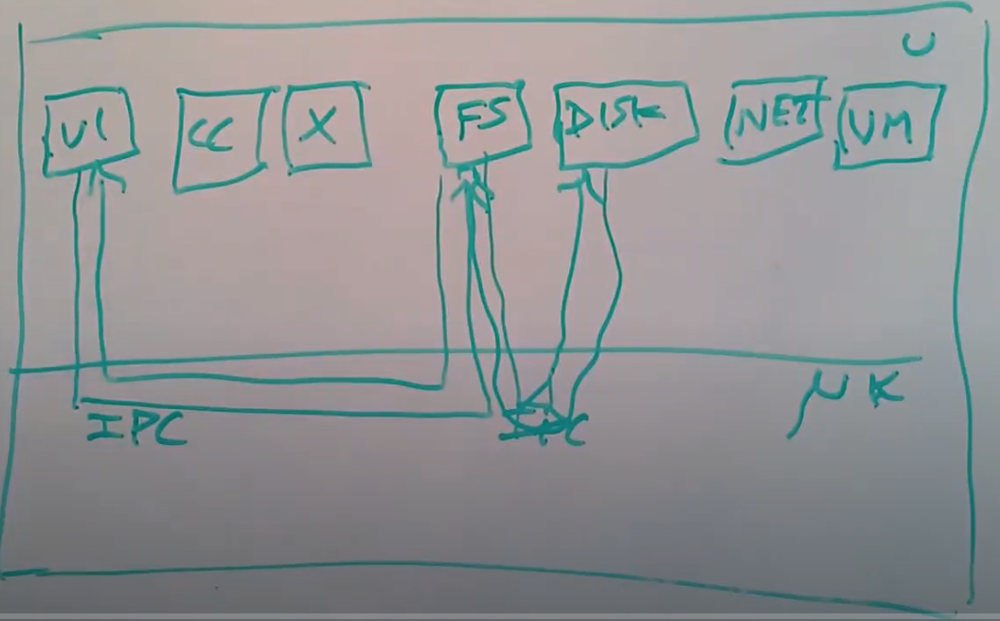

# Micro Kernel

## 1. 微内核的基本概念
微内核（micro kernel）是一种操作系统的设计概念，它的核心就是实现了进程间通信（IPC，Inter-Process Communication）以及线程和任务的tiny kernel。

所以微内核只提供了进程抽象和通过IPC进程间通信的方式，除此之外别无他物。任何你想要做的事情，例如文件系统，你都会通过一个用户空间进程来实现，完全不会在内核中实现。

微内核的基本架构如下：

举例说明微内核的工作模式：

- 当文本编辑器VI需要读取一个文件时，它需要与文件系统进行交互，所以它通过IPC会发送一条消息到文件系统进程，文件系统进程中包含了所有的文件系统代码，它知道文件，目录的信息；
- 文件系统进程需要与磁盘交互，所以它会发送另一个IPC到磁盘驱动程序；
- 磁盘驱动程序再与磁盘硬件进行交互，之后磁盘驱动会返回一个磁盘块给文件系统；
- 最后文件系统再将VI请求的数据通过IPC返回给VI。
  
该过程涉及的程序如VI、文件系统、磁盘驱动程序等都在内核外。

在内核中唯一需要做的是支持进程/任务/线程，以及支持IPC来作为消息的传递途径，除此之外内核不用做任何事情。

## 2. 宏内核（monolithic kernel）与微内核（micro kernel）各自的优劣

### 2.1 宏内核的优劣
宏内核的优势：
1. 移植性强。宏内核这些高度抽象的接口通常是可移植的，你可以将其运行在各种各样的硬件之上，并且也可以向应用程序隐藏复杂性。

2. 抽象性强。这里的强大的抽象还可以帮助管理共享资源，例如我们将内存管理委托给了内核，内核会跟踪哪些内存是空闲的，这样应用程序就不用考虑这些问题，所以这可以帮助简化应用程序，同时也可以提供健壮性和安全性；

3. 集成度高。因为所有这些功能都在一个程序里面，所有的内核子系统，例如文件系统，内存分配，调度器，虚拟内存系统都是集成在一个巨大的程序中的一个部分，这意味着它们可以访问彼此的数据结构，进而使得依赖多个子系统的工具更容易实现；

4. 权限完整。内核的所有代码都以完整的硬件权限在运行，举个例子，整个XV6都运行在Supervisor mode，这意味着你可以读写任意内存地址，并且所有的内核代码都以最大的权限在运行。Linux操作系统也是这样。

宏内核的劣势：
1. 宏内核大且复杂。内部代码有大量的交互和依赖，如果你使用了大的内核，你不可避免的会遇到Bug和安全漏洞；

2. 随着时间的推移，宏内核倾向于发展成拥有所有的功能。这种特性不适合宏内核用于一些专有用途的产品；

3. 因为宏内核集成度高，抽象性强，它们会削弱一些复杂的抽象能力。在内核中会有大量的设计考虑，应用程序需要遵守这些设计并与之共存，有时候并不会按照你想要的方式工作。

2.2 微内核的优劣

微内核的优势：
1. 方便模块化设计。这种将内核拆分，并在用户空间的不同部分运行，比如说在用户空间运行文件系统服务，可以使得代码更模块化；

2. 用户空间代码通常会比内核更容易被修改，调整和替换，所以它更容易被定制化；

3. 更小的内核更容易实现，bug和crash更少。内核太大的情况下，如果内核出错了，通常你需要panic并重启，因为如果内核有Bug，并且会随机更改数据，那就不能信任内核了；

4. 你可以在微内核上模拟或者运行多个操作系统。所以尽管微内核几乎不做任何事情，你还是可以在它之上运行一个Unix系统（作为微内核之外的一个应用程序），或许还可以在同一个机器上运行超过一个操作系统。

微内核的劣势：
1. 微内核的系统调用接口需要尽可能的简单，因为使用微内核的出发点就是内核很小，这是一个挑战；

2. 微内核完全不知道文件和文件系统，我们需要开发一些用户空间服务来实现操作系统的其他部分；

3. 微内核的设计需要进程间通过IPC有大量的通信，所以对IPC性能要求非常高，而宏内核的模块之间可以直接交互。

## 3. 提升IPC性能
最初的IPC设计为异步的，也就是进程P1需要发消息给进程P2，需要进入内核并将消息拷贝到内核，退出内核继续工作后，P2进入内核接收信息，这种异步方式需要多次切换内核用户状态，以及多次拷贝，速度非常慢。

为了提升IPC性能，我们采用同步（Synchronized）的办法：

1. 这里不会丢下消息并等待另一个进程去获取消息，这里的send会等待消息被接收，并且recv会等待回复消息被发送。如果我是进程P1，我想要发送消息，我会调用send，P1的send会等待P2调用recv。当P1和P2都到达了内核中，也就是P1因为调用send进入内核，P2因为调用recv进入内核，这时才会发生消息传递；

2. 当send和recv都在内核中时，内核可以直接将消息从用户空间P1拷贝到用户空间P2，而不用先拷贝到内核中，再从内核中拷出来；

3. 如果消息超级小，比如说只有几十个字节，它可以在寄存器中传递，而不需要拷贝，你可以称之为Zero Copy；

4. 对于非常长的消息，可以在一个IPC消息中携带一个Page映射，所以对于巨大的消息，你可以发送一个物理内存Page，这个Page会被再次映射到目标Task地址空间，这里也没有拷贝，提供的是共享Page的权限，这种方法比拷贝快的多。

## 4. 在L4微内核上运行Linux

在L4微内核上运行Linux的基本思路是：
L4微内核位于底部，但是同时一个完整的Linux作为一个巨大的服务运行在用户空间进程中。

Linux kernel不过就是一个程序，对其做一些修改它就可以运行在用户空间。

这里需要对Linux的底层做一些修改，例如Linux中期望能直接修改Page Table的内容，读写CPU寄存器。Linux中一部分需要被修改以将它们改成调用L4微内核的系统调用，或者发送IPC，而不是直接访问硬件。

但是Linux的大部分内容都可以不做修改而直接运行。所以按照这种方式，作为Linux的一部分，现在得到了文件系统，网络支持，各种设备驱动等等，而不需要自己实现这些。

这里的Linux kernel运行在一个L4线程中，然而这个线程会使用与XV6中的context switching非常相似的技术，在与每个用户进程对应的内核线程之间切换。不过这些内核线程完全是在Linux中实现的，与L4线程毫无关系，唯一的L4线程就是运行了Linux kernel的控制线程。