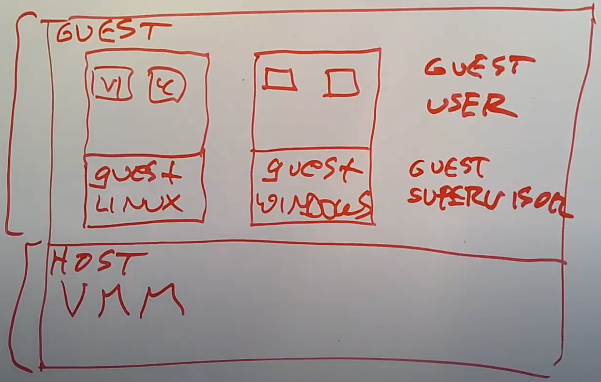

# Virtual Machine

## 1. 虚拟机的基本概念
### 1.1 虚拟机的定义
虚拟机是对于计算机的一种模拟，这种模拟足够能运行一个操作系统。

### 1.2 使用虚拟机的原因
有很多原因使得人们会在一个计算机上运行多个相互独立的操作系统：

1. 在一个大公司里面，你需要大量的服务，例如DNS，Firewall等等，但是每个服务并没有使用太多的资源，所以单独为这些服务购买物理机器有点浪费，但是将这些低强度的服务以虚拟机的形式运行在一个物理机上可以节省时间和资金；
   
2. 虚拟机在云计算中使用的也非常广泛。云厂商不想直接出借物理服务器给用户，因为这很难管理，它们想向用户出借的是可以随意确定不同规格的服务器；
3. 或许有两个用户在一台物理服务器上，但是他们并没有太使用计算机，这样AWS可以继续向同一个物理服务器上加入第三或者第四个用户。这样可以不使用额外的资金而获得更高的收益。所以，虚拟机提供了额外的灵活性；
4. 最后，通过新增的VMM提供的抽象可以实现更多的功能。例如，你可以为整个操作系统和其中的用户进程做一个快照，并在磁盘中保存下来，稍后再恢复快照；还可以将一个Guest操作系统迁移到另一个计算机上，就像容器迁移那样。
   
## 2. 虚拟机的设计   
### 2.1 虚拟机的架构
虚拟机架构图如下：

- 在架构的最底层，位于硬件之上存在一个Virtual Machine Monitor（VMM），它取代了标准的操作系统内核。VMM所在的就是Host空间，它的工作是模拟多个计算机用来运行Guest操作系统；

- Host往上一层被称为Guest空间。在Host空间运行的是VMM，在Guest空间运行的是普通的操作系统；

- 在Guest空间，会有一个或者多个Guest操作系统内核，或许其中一个是Linux kernel。这里的Linux kernel会觉得自己就是个普通的内核，并在自己之上还运行一堆用户进程，例如VI，C Compiler等。我们或许还有另一个Guest运行了Windows操作系统，同时也包含了Windows用户进程；

- 除此之外，在Guest空间又可以分为Guest Supervisor Mode（也就是Guest操作系统内核态），和Guest User Mode（也就是Guest操作系统用户态）。

### 2.2 Guest的隔离性
在Guest空间中，有可能客户运行的不是普通的Linux而是一个特殊的修改过的Linux，并且会试图突破虚拟机的限制来访问其他用户的虚拟机等，所以Guest不能从虚拟机中逃逸非常重要。一般有以下隔离措施：

- Guest可以通过VMM使用内存，但是不能使用不属于自己的内存，类似的，Guest也不应该在没有权限的时候访问存储设备或者网卡；
  
- 虚拟机在很多方面比普通的Linux进程提供了更加严格的隔离，运行在同一个计算机上的不同虚拟机是通过VMM完全隔离的，彼此之间不可以进行通信。

### 2.3 虚拟机的trap
当guest空间的操作系统需要执行一些privileged指令时，需要进行一个trap and emulate机制。

其中guest空间中操作系统内核的trap的实现：

1. 首先将Guest kernel运行在宿主机的User mode，这是最基本的策略；
   
2. 通过VMM启动一个操作系统时，VMM会将操作系统的kernel指令加载到内存的某处，再设置好合适的Page Table使得操作系统看起来自己的内存是从地址0开始向高地址走。之后VMM会使用trap或者sret指令（注，详见6.8）来跳转到位于User mode的Guest操作系统的第一条指令，这样不论拥有多少条指令，Guest操作系统就可以一直执行下去；
3. 一旦Guest操作系统需要使用privileged指令，因为它当前运行在User mode而不是Supervisor mode，会使得它触发trap并走回到VMM中（在一个正常操作系统中，如果在User mode执行privileged指令，会通过trap走到内核，但是现在VMM替代了内核）；
4. trap之后VMM就可以获得控制权，并可以查看是什么指令引起的trap，并做适当的处理。

这里核心的点在于Guest操作系统并没有实际的设置SATP寄存器，而是由底层的VMM来实现，这个实现过程就涉及到VMM对于guest系统指令的emulate。

### 2.4 虚拟机的emulate
VMM会为每一个Guest维护一套虚拟状态信息。所以VMM里面会维护虚拟的STVEC寄存器，虚拟的SEPC寄存器以及其他所有的privileged寄存器。

当Guest操作系统运行指令需要读取某个privileged寄存器时，例如读取SEPC寄存器，会经历以下流程：
1. 指令首先会通过trap走到VMM，因为在用户空间读取privileged寄存器是非法的；
   
2. VMM会检查这条指令，它发现这是一个读取SEPC寄存器的指令；
3. 接下来VMM会模拟这条指令，并将自己维护的虚拟SEPC寄存器，拷贝到trapframe的用户寄存器中，注意trapframe是用于trap的一个中间跳板；
4. 接下来VMM会将trapframe中保存的用户寄存器拷贝回真正的用户寄存器，通过sret指令，使得Guest从trap中返回；
5. 这时，用户寄存器a0里面保存的就是SEPC寄存器的值了，之后Guest操作系统会继续执行指令。
   
经过这些流程，Guest读到了VMM替自己保管的虚拟SEPC寄存器。

在这种虚拟机的实现中，Guest整个运行在用户空间，任何时候它想要执行需要privilege权限的指令时，会通过trap走到VMM，VMM可以模拟这些指令。

上面这种实现机制叫做Trap and Emulate：

Guest执行系统调用以为自己通过trap走到了Guest内核，但是实际上却走到了VMM，这时VMM需要做一些emulate处理再与硬件交互，让Guest以及之后Guest的所有privileged指令都看起来好像是Guest真的走到了Guest内核。

### 2.5 虚拟机的page table
Trap and Emulate机制中还包括对page table的处理。为了隔离性，guest不能直接通过trap来读写物理内存，也就是说它的虚拟地址不能直接映射到真实的物理地址，中间必须有一个隔离。否则Guest就可以访问任意的内存地址，而不只是VMM分配给它的内存地址。

所以虚拟机的page table是这样设计的：

guest虚拟内存空间（gva）

$\Downarrow$

guest物理内存空间（gpa，实际上是vmm的分配给该guest的虚拟内存空间，用于隔离guest）

$\Downarrow$

主机物理内存空间（hpa，真正的物理内存空间）

vmm采用将这一流程整合成一个shadow page table，Shadow Page Table是这么构建的：
1. 从Guest Page Table（gva）中取出每一条记录，查看gpa。
2. 使用VMM中的映射关系，将gpa翻译成hpa。
3. 再将gva和hpa存放于Shadow Page Table。

这样一来，Guest kernel认为自己使用的是一个正常的Page Table，但是实际上它无法直接映射到真实物理内存地址，硬件使用的是隔离处理后的Shadow Page Table。

### 2.6 虚拟机的device
当guest的操作系统想要调用外设时，虚拟机需要能够至少使得Guest认为所有它需要的外部设备是存在的。主要有三种方案：

1. 第一种策略是模拟设备，也就是模拟一些需要用到的并且使用非常广泛的设备，例如磁盘。这里的实现方式是，Guest操作系统仍然会像与真实硬件设备交互一样，通过Memory Map控制寄存器与设备进行交互。通常来说，操作系统会假设硬件已经将自己的控制寄存器映射到了内核地址空间的某个地址上，但在VMM中不会映射这些内存地址对应的Page，相应的会将这些Page设置成无效。这样当Guest操作系统尝试使用UART或者其他硬件时，一访问这些地址就会通过trap走到VMM。VMM查看指令并发现Guest正在尝试在UART发送字符或者从磁盘中读取数据。VMM中会对磁盘或者串口设备有一些模拟，通过这些模拟，VMM知道如何响应Guest的指令，之后再恢复Guest的执行；

2. 第二种策略是提供虚拟设备。通过在VMM中构建特殊的设备接口，可以使得Guest中的设备驱动与VMM内支持的设备进行高效交互。现在的Guest设备驱动中可能没有Memory Mapped寄存器了，但是相应的在内存中会有一个命令队列，Guest操作系统将读写设备的命令写到队列中。之后vmm会从内存中读取这些命令，但是并不会将它们应用到设备中，而是将它们应用到设备对应的一个文件。这种方式比直接模拟硬件设备性能要更高，因为你可以在VMM中设计设备接口，使其并不需要太多的trap，但是只能用于知道该虚拟设备的操作系统。

3. 第三个策略是对于真实设备的pass-through。这里典型的例子就是网卡，现代的网卡具备硬件的支持，可以与VMM运行的多个Guest操作系统交互。你可以配置你的网卡，使得它表现的就像多个独立的子网卡，每个Guest操作系统拥有其中一个子网卡。经过VMM的配置，Guest操作系统可以直接与它在网卡上那一部分子网卡进行交互，并且效率非常的高。所以这是现代的高性能方法。在这种方式中，Guest操作系统驱动可以知道它们正在与这种特别的网卡交互。

### 2.7 硬件对虚拟机的支持
硬件对虚拟机的支持主要在以下几个方面：
1. 硬件专门提供了虚拟控制寄存器。在Trap and Emulate方案中，VMM会为每个Guest在软件中保存一份虚拟状态信息，而现在，这些虚拟状态信息会保存在硬件中。这样Guest中的软件可以直接执行privileged指令来修改保存在硬件中的虚拟寄存器，而不是通过trap走到VMM来修改VMM中保存在软件中的虚拟寄存器。在Guest mode下可以直接读写控制寄存器保存在硬件中的拷贝，在Host mode中会使用真实的寄存器。
   
   当我们运行在Guest kernel时，比如说如果想读写STVEC寄存器，硬件允许我们直接读写STVEC寄存器的non-root拷贝。这样，privileged指令可以全速运行，而不用通过trap走到VMM。这对于需要触发大量trap的代码，可以运行的快得多。

2. 硬件支持新虚拟机的建立。现在当VMM想要创建一个新的虚拟机时，VMM需要配置硬件。在VMM的内存中，通过一个结构体与VT-x硬件进行交互。这个结构体称为VMCS（Virtual Machine Control Structure）。当VMM要创建一个新的虚拟机时，它会先在内存中创建这样一个结构体，并填入一些配置信息和所有寄存器的初始值，之后VMM会告诉VT-x硬件说我想要运行一个新的虚拟机，并且虚拟机的初始状态存在于VMCS中。Intel通过一些新增的指令来实现这里的交互。

3. 硬件支持guest的page table。当计算机上的MMU在翻译Guest的虚拟内存地址时，它会先根据Guest设置好的Page Table，将Guest虚拟地址（gva）翻译到Guest 物理地址（gpa）。之后再通过EPT寄存器，将Guest物理地址（gpa）翻译成主机物理地址（hpa）。硬件会为每一个Guest的每一个内存地址都自动完成这里的两次翻译。

