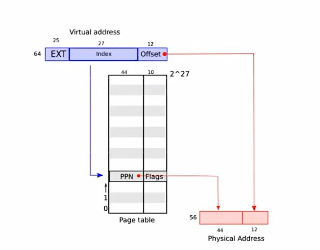
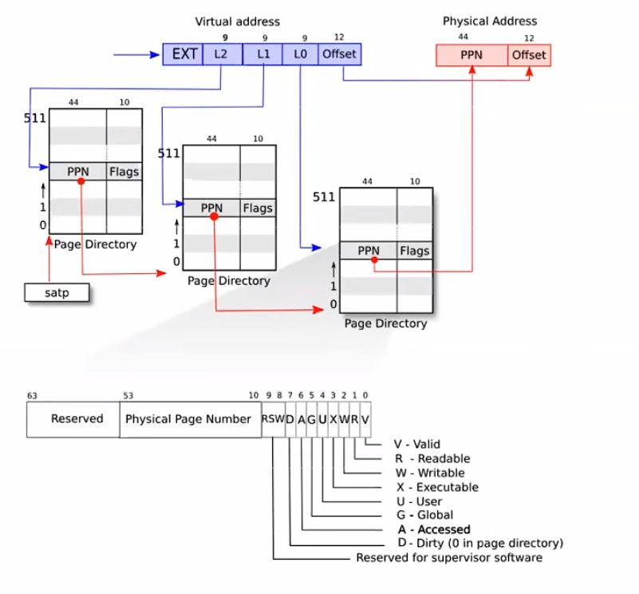
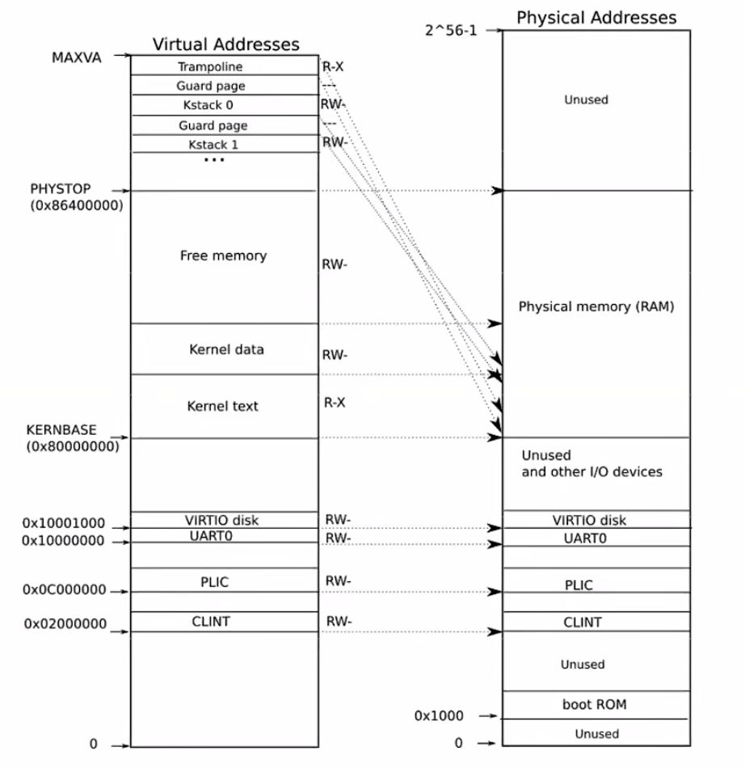
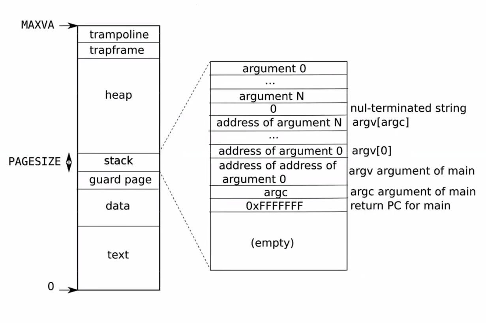

# Page table
## 1. 虚拟内存概述
### 1.1 每个进程都有自己的内存块
每个进程的内存块保证彼此之间隔离开来，互不干扰；同时每个应用程序都保存有自己的虚拟-物理地址映射表。

### 1.2 cpu执行内存相关指令
cpu执行的指令中，其内存地址都是虚拟内存地址，必须通过内存管理单元（mmu）将虚拟内存地址映射为物理内存地址，再去执行。

### 1.3 映射
一个page大小为4kb，即4096字节。

上图中可以看出，虚拟地址的组成部分为ext+index(索引)+offset(偏移量)，通过索引可以在page table上找到物理地址编号PPN，再加上偏移量offset即为对应物理地址。

事实上，虚拟地址到物理地址的映射过程中需要三级page table映射：进程访问虚拟地址时，通过satp寄存器记录的物理地址找到第一级page table，第一级page table映射到第二级，第二级映射到第三级，第三级才正式映射到对应的物理地址PPN，这更加节省条目数，减少驻留在内存中的无用页表数目，因为它只需要3*512个条目就可以找到物理地址，前一种方法需要2^27个条目才行。

page table的前44位用于记录PPN，而后10位用于记录各种标志位，其中valid位代表该条目是否有效，RWX代表权限，

### 1.4 后备缓冲区（TLB）
按照1.3中的多级页表方法，完成虚拟地址映射需要访问三次内存，效率很慢，因此提出了TLB。TLB介于CPU和CPU缓存（cache）之间，用于缓存一部分标签页表条目，如果切换到新的页表，TLB也会跟着刷新。

## 2. xv6的虚拟内存

### 2.1 物理内存（右侧）
物理地址读完0x1000的boot ROM后，直接跳到0x8000的内存地址处。因此0x0000~0x8000之间的这部分物理地址并不属于内存，而是指向其它硬件设备。

### 2.2 内核虚拟内存（左侧）
xv6的虚拟地址到物理地址采用恒等映射，也就是虚拟地址0x2000对应物理地址0x2000，这在PHYSTOP之下的虚拟地址适用，在PHYSTOP之上的虚拟地址要经过两次映射才能找到对应的物理地址。

### 2.3 用户的虚拟内存地址布局

这张图展示了在 xv6 中，一个运行中进程的用户内存结构。堆在栈之上，所以它可以增长（通过 sbrk）。栈占用了单独的一页内存，其中存有 exec 创建的初始数据。栈的最上方放着字符串形式的命令行参数以及指向这些参数的指针数组，其下方放的值使得一个程序可以从 main 开始，仿佛刚刚调用了函数 main(argc, argv)。为了防止栈使用了它不应该使用的页，栈的下方有一个保护页。保护页没有映射，因此当栈的增长超出其所在页时就会产生异常，因为无法翻译这个错误的地址。

### 2.4 物理内存分配器
xv6通过维护一个物理页组成的链表，也就是物理内存分配器，来寻找空闲页。所以，分配内存需要将页移出该链表，而释放内存需要将页加入该链表。

