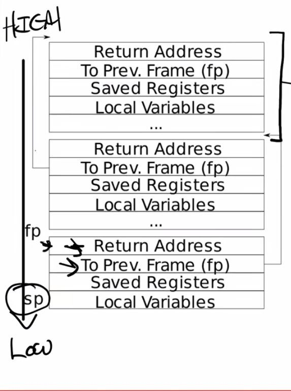

# RISC-V Calling Convention and Stack Frames
## 1. C to Asm
C -> Asm -> 二进制文件(.o文件)

## 2. RISC-V汇编
RISC-V使用精简指令集（RISC），x86-64使用复杂指令集（CISC）

## 3. 寄存器
寄存器储存将要参与运算的值，可以在load指令中看到

# 4. 栈帧

每个帧都是从高地址到低地址延伸的，帧内部是从低地址到高地址延伸

# 5. gdb调试

