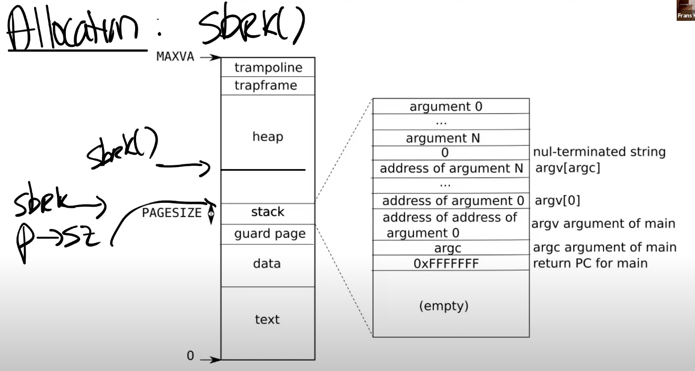
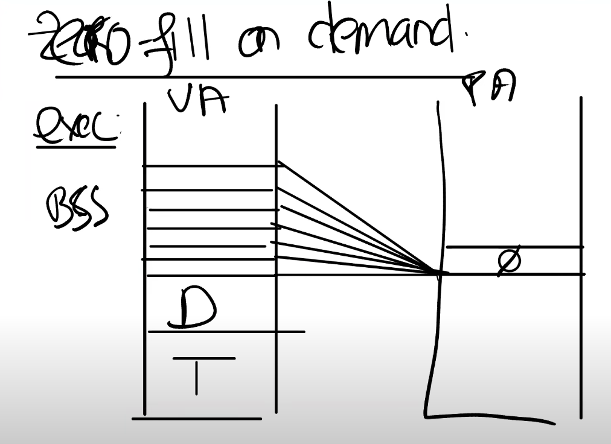
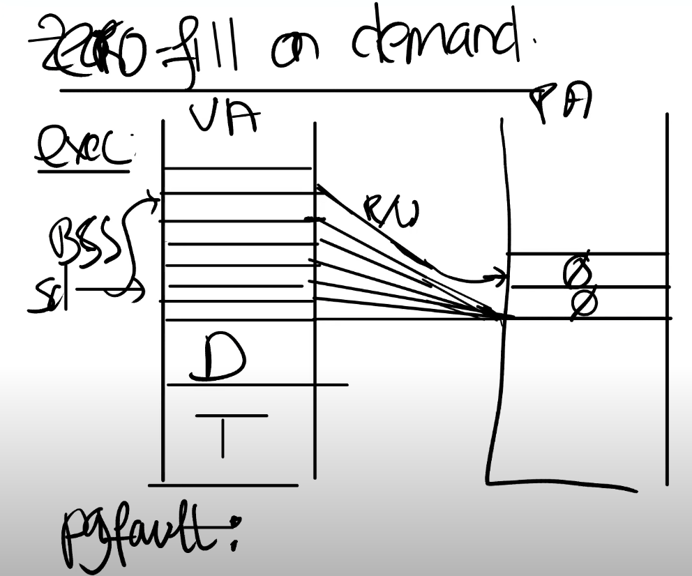
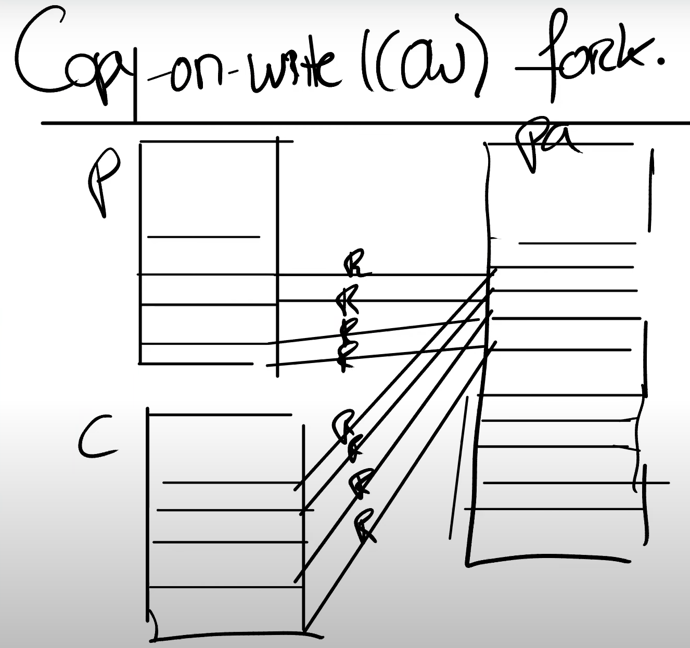
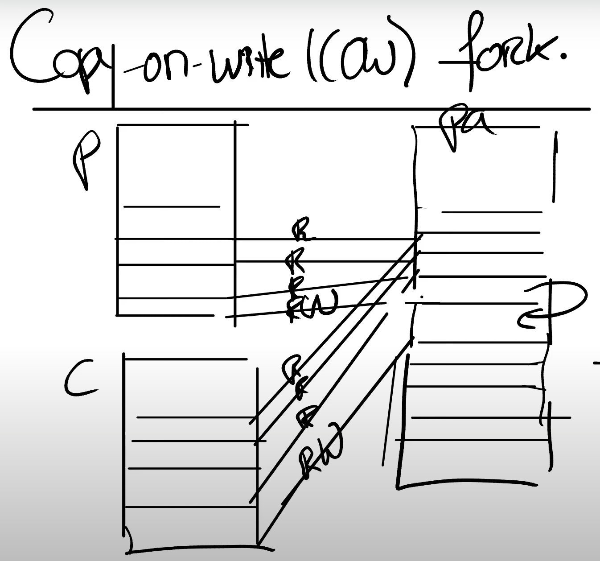

# Page Fault
## 1. Page Fault的解释
当CPU无法将虚拟地址转换为物理地址时，CPU会生成页面故障异常（Page Fault）。RISC-V有三种不同类型的页面错误：
1. load加载页面错误（当加载指令无法转换其虚拟地址时）；
2. store存储页面错误（当存储指令无法转换其虚拟地址时）；
3. jump指令页错误（当指令的地址无法转换时）。

scause寄存器中的值表示页面故障的类型，而stval寄存器包含无法转换的地址。

## 2. page fault的特点
### 2.1 page fault使地址映射关系动态化
你可以认为虚拟内存有两个主要的优点：

- 第一个是Isolation，隔离性。虚拟内存使得操作系统可以为每个应用程序提供属于它们自己的地址空间。所以一个应用程序不可能有意或者无意的修改另一个应用程序的内存数据。虚拟内存同时也提供了用户空间和内核空间的隔离性，我们在之前的课程已经谈过很多相关内容，并且你们通过page table lab也可以理解虚拟内存的隔离性。
- 另一个好处是level of indirection，提供了一层抽象。处理器和所有的指令都可以使用虚拟地址，而内核会定义从虚拟地址到物理地址的映射关系。这一层抽象是我们这节课要讨论的许多有趣功能的基础。不过到目前为止，在XV6中内存地址的映射都比较无聊，实际上在内核中基本上是直接映射（注，也就是虚拟地址等于物理地址）。当然也有几个比较有意思的地方：
  - trampoline page，它使得内核可以将一个物理内存page映射到多个用户地址空间中。
  - guard page，它同时在内核空间和用户空间用来保护Stack。

page fault可以让这里的地址映射关系变得动态起来。通过page fault，内核可以更新page table，这是一个非常强大的功能。因为现在可以动态的更新虚拟地址这一层抽象，结合page table和page fault，内核将会有巨大的灵活性。

### 2.2 page fault的机制
从硬件和XV6的角度来说，当出现了page fault，有3个对我们来说极其有价值的信息，分别是：
- 引起page fault的内存地址
- 引起page fault的原因类型，包括load、store、jump三个原因
- 引起page fault时的程序计数器值，这表明了page fault在用户空间发生的位置

根据上述三种信息，可以利用page fault handler修复page table并实现一些虚拟内存功能。

## 3. Page Fault的应用
### 3.1 lazy page allocation
sbrk是xv6提供的系统调用，它负责为堆分配资源：

sbrk为在堆的底部，栈的顶部。当调用sbrk时，它的参数是整数，代表了你想要申请的字节数量，sbrk可以扩展堆的上边界；类似的，应用程序还可以通过给sbrk传入负数作为参数，来减少或者压缩堆的地址空间。

一旦调用了sbrk，内核会立即分配应用程序所需要的物理内存。但是实际上，应用程序很难预测自己需要多少内存。使用虚拟内存和page fault handler，我们完全可以用某种更聪明的方法来解决这里的问题，这里就是利用lazy allocation。

lazy allocation核心思想非常简单，基本流程为
1. 提升p->sz（这里我们用p->sz来表示sbrk），将p->sz增加n，其中n是需要新分配的内存数量，但是内核在这个时间点并不会分配任何物理内存。
2. 之后在某个时间点，应用程序使用到了新申请的那部分内存，这时会触发page fault，因为我们还没有将新的内存映射到page table。所以，如果我们解析一个大于旧的p->sz，但是又小于新的p->sz（注，也就是旧的p->sz + n）的虚拟地址，我们希望内核能够分配一个内存page，并且重新执行指令。

3. 当我们看到了一个page fault，相应的虚拟地址小于当前p->sz，同时大于stack，那么我们就知道这是一个来自于heap的地址，但是内核还没有分配任何物理内存。所以对于这个page fault的响应为：
   - 在page fault handler中，通过kalloc函数分配一个内存page；- 初始化这个page内容为0；
   - 将这个内存page映射到user page table中；
   - 最后重新执行指令。 
   
   比方说，如果是load指令，或者store指令要访问属于当前进程但是还未被分配的内存，在我们映射完新申请的物理内存page之后，重新执行指令应该就能通过了。
 
### 3.2 Zero Fill On Demand
当查看一个用户程序的地址空间时，存在text区域，data区域，同时还有一个BSS区域（注，BSS区域包含了未被初始化或者初始化为0的全局或者静态变量）。当编译器在生成二进制文件时，编译器会填入这三个区域。text区域是程序的指令，data区域存放的是初始化了的全局变量，BSS包含了未被初始化或者初始化为0的全局变量。

对于BSS，通常可以调优的地方是，虚拟内存中有如此多的内容全是0的page，在物理内存中，我只需要分配一个page，这个page的内容全是0。然后将所有虚拟地址空间的全0的page都map到这一个物理page上。这样至少在程序启动的时候能节省大量的物理内存分配。如下图所示：

但是这里存在一个问题，我们不能允许对于这个page执行写操作，因为所有的虚拟地址空间page都期望page的内容是全0，所以这里的PTE都是只读的。之后在某个时间点，应用程序尝试写BSS中的一个page时，比如说需要更改一两个变量的值，我们会得到page fault。

对于该场景的page fault，我们需要做的是，在物理内存中申请一个新的内存page，将其内容设置为0，因为我们预期这个内存的内容为0。之后我们需要更新这个page的mapping关系，首先PTE要设置成可读可写，然后将其指向新的物理page。这里相当于更新了PTE，之后我们可以重新执行指令。这样在改变BSS中部分变量的值的同时，节省了内存空间。

### 3.3 Copy On Write(COW) Fork
在fork中，父进程和子进程共享一个物理内存空间。这里需要非常小心，因为我们希望在父进程和子进程之间有强隔离性，一旦子进程想要修改这些内存的内容，相应的更新应该对父进程不可见。为了确保进程间的隔离性，我们可以将这里的父进程和子进程的PTE的标志位都设置成只读的。

在某个时间点，当我们需要更改内存的内容时，我们会得到page fault。因为父进程和子进程都会继续运行，而父进程或者子进程都可能会执行store指令来更新一些全局变量，这时就会触发page fault，因为现在在向一个只读的PTE写数据。所以触发page fault后，我们需要进行以下操作：

1. 在得到page fault之后，我们需要拷贝相应的物理page。假设现在是子进程在执行store指令，那么我们会分配一个新的物理内存page，然后将page fault相关的物理内存page拷贝到新分配的物理内存page中；
2. 将新分配的物理内存page映射到子进程。这时，新分配的物理内存page只对子进程的地址空间可见，所以我们可以将相应的PTE设置成可读写，并且我们可以重新执行store指令；
3. 另外，对于触发刚刚page fault的物理page，因为现在只对父进程可见，相应的PTE对于父进程也变成可读写的了。

### 3.4 Demand Paging
操作系统会加载程序内存的text，data区域，并且以eager的方式将这些区域加载进page table。所谓eager的方式，就是在虚拟地址空间中，我们为text和data分配好地址段，但是相应的PTE并不对应任何物理内存page。对于这些PTE，我们只需要将valid bit位设置为0即可。

之所以采用eager的方式将text和data加载进page table，是因为两点：
- 程序的二进制文件可能非常的巨大，将它全部从磁盘加载到内存中将会是一个代价很高的操作；
- data区域的大小可能远大于常见的场景所需要的大小，我们并不一定需要将整个二进制都加载到内存中。
  
所以eager的方式节省了内存。

接下来在程序运行时，在最坏的情况下，用户程序使用了text和data中的所有内容，那么我们将会在应用程序的每个page都收到一个page fault。但是如果我们幸运的话，用户程序并没有使用所有的text区域或者data区域，那么我们一方面可以节省一些物理内存，另一方面我们可以让exec运行的更快（注，因为不需要为整个程序分配内存）。

另外还需要讨论一个问题：OOM（out of memory）。我们将要读取的文件，它的text和data区域可能大于物理内存的容量。又或者多个应用程序按照demand paging的方式启动，它们二进制文件的和大于实际物理内存的容量，这就造成了OOM。

对于OOM，一个解决方法是撤回page（evict page）。比如说将部分内存page中的内容写回到文件系统再撤回page。一旦你撤回并释放了page，那么你就有了一个新的空闲的page，你可以使用这个刚刚空闲出来的page，分配给刚刚的page fault handler，再重新执行指令。

撤回page的选择策略：
- 最常用的策略，Least Recently Used（LRU）；
- 在LRU基础上的优化：如果要撤回一个page，就需要在dirty page和non-dirty page中做选择。dirty page是曾经被写过的page，而non-dirty page是只被读过，但是没有被写过的page。一般选择non-dirty page撤回。

### 3.5 内存映射文件（Memory Mapped Files）
所谓内存映射文件，就是将文件映射到内存，文件对应于内存中的一个字节数组，对文件的操作变为对这个字节数组的操作，而字节数组的操作直接映射到文件上。这种映射可以是映射文件全部区域，也可以是只映射一部分区域。

内存映射文件有3个特点：

- 这种映射是操作系统提供的一种假象，文件一般不会马上加载到内存，操作系统只是记录下了这回事，当实际发生读写时，才会按需加载。操作系统一般是按页加载的，页可以理解为就是一块，页的大小与操作系统和硬件相关，典型的配置可能是4K, 8K等，当操作系统发现读写区域不在内存时，触发page fault就会加载该区域对应的一个页到内存。这种按需加载的方式，使得内存映射文件可以方便处理非常大的文件，内存放不下整个文件也不要紧，操作系统会自动进行处理，将需要的内容读到内存，将修改的内容保存到硬盘，将不再使用的内存释放。
  
- 在一般的文件读写中，会有两次数据拷贝，一次是从硬盘拷贝到操作系统内核，另一次是从操作系统内核拷贝到用户态的应用程序。而在内存映射文件中，一般情况下，只有一次拷贝，且内存分配在操作系统内核，应用程序访问的就是操作系统的内核内存空间，这显然要比普通的读写效率更高。
  
- 内存映射文件可以被多个不同的应用程序共享，多个程序可以映射同一个文件，映射到同一块内存区域，一个程序对内存的修改，可以让其他程序也看到，这使得它特别适合用于不同应用程序之间的通信。

### 3.6 真实操作系统内存的情况
实际上在一台操作系统中，正常情况下大部分内存都被使用了，其中一小部分用于应用程序，大部分作为buffer/cache存在。另外，实际物理内存空间远小于进程的虚拟内存空间，这归功于page fault动态内存映射带来的内存节省。

现在的空闲内存（free）或许足够几个page用，但是在某个时间点如果需要大量内存的话，要么是从应用程序，要么是从buffer/cache中，需要撤回已经使用的一部分内存。所以，当内核在分配内存的时候，通常都不是一个低成本的操作，因为并不总是有足够的可用内存，为了分配内存需要先撤回一些内存。
