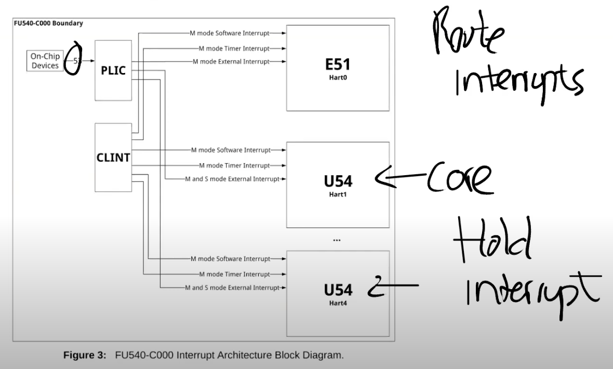

# Interrupt
## 1. 中断的基本概念
### 1.1 中断的定义
中断对应的场景很简单，就是硬件想要得到操作系统的关注。例如网卡收到了一个packet，网卡会生成一个中断；用户通过键盘按下了一个按键，键盘会产生一个中断。操作系统需要做的是，保存当前的工作，处理中断，处理完成之后再恢复之前的工作。这里的保存和恢复工作，与我们之前看到的系统调用过程（system call）非常相似。所以system call，page fault，Interrupt，都使用相同的机制。

### 1.2 中断与系统调用的区别
中断与系统调用主要有3个小的差别：
1. 异步。当硬件生成中断时，Interrupt handler与当前运行的进程在CPU上没有任何关联，CPU对于中断是没有任何预先准备的。但如果是系统调用的话，系统调用发生在运行进程的context下。
2. 并发。对于中断来说，CPU和生成中断的设备是并行的在运行。网卡自己独立的处理来自网络的packet，然后在某个时间点产生中断，但是同时，CPU也在运行。所以我们在CPU和设备之间是真正的并行的，我们必须管理这里的并行。
3. 外设。外部设备例如网卡，UART，而这些设备需要被编程。每个设备都有一个编程手册，就像RISC-V有一个包含了指令和寄存器的手册一样。设备的编程手册包含了它有什么样的寄存器，它能执行什么样的操作，在读写控制寄存器的时候，设备会如何响应。

## 2. 中断的机制
### 2.1 中断的硬件部分
在内核虚拟地址中，物理内存的地址在0x80000000之上，而其它外设的地址在0x8000000之下。类似于读写内存，通过向相应的设备地址执行load/store指令，我们就可以对例如UART的设备进行编程。

处理器上是通过Platform Level Interrupt Control，简称PLIC来处理设备中断，PLIC的结构图如下：

从左上角可以看出，有53个不同的来自于设备的中断。这些中断到达PLIC之后，PLIC会路由这些中断。图的右下角是CPU的核，PLIC会将中断路由到某一个CPU的核。如果所有的CPU核都正在处理中断，PLIC会保留中断直到有一个CPU核可以用来处理中断。所以PLIC需要保存一些内部数据来跟踪中断的状态。
PLIC执行的具体流程是：
1. PLIC会通知当前有一个待处理的中断
2. 其中一个CPU核会Claim接收中断，这样PLIC就不会把中断发给其他的CPU处理
3. CPU核处理完中断之后，CPU会通知PLIC
4. PLIC将不再保存中断的信息

### 2.2 中断的软件部分（驱动）
大部分驱动可以分为bottom和top两部分，我们这里以UART作为例子：
- bottom部分通常是Interrupt handler。当一个中断送到了CPU，并且CPU设置接收这个中断，CPU会调用相应的Interrupt handler。Interrupt handler并不运行在任何特定进程的context中，它只是处理中断。
- top部分，是用户进程或者内核的其他部分调用的接口。对于UART来说，这里有read/write接口，这些接口可以被更高层级的代码调用。

操作系统中需要对外设进行编程。设备地址出现在物理地址的特定区间内，这个区间由主板制造商决定。操作系统需要知道这些设备位于物理地址空间的具体位置，然后再通过普通的load/store指令对这些地址进行编程，load/store指令实际上的工作就是读写设备的控制寄存器。（例如，对网卡执行store指令时，CPU会修改网卡的某个控制寄存器，进而导致网卡发送一个packet。所以这里的load/store指令不会读写内存，而是会操作设备。）

### 2.3 中断运行的例子
当XV6启动时，Shell会输出提示符“$ ”，如果我们在键盘上输入ls，最终可以看到“$ ls”。我们接下来通过研究Console是如何显示出“$ ls”，来看一下设备中断是如何工作的。

实际上“$ ”和“ls”还不太一样，“$ ”是Shell程序的输出，而“ls”是用户通过键盘输入之后再显示出来的。

1. 对于“ $ ”来说，实际上就是设备会将字符传输给UART的寄存器，UART之后会在发送完字符之后产生一个中断。在QEMU中，模拟的线路的另一端会有另一个UART芯片（模拟的），这个UART芯片连接到了Console，它会进一步将“ $ ”显示在console上。
2. 对于“ls”，这是用户输入的字符。键盘连接到了UART的输入线路，当你在键盘上按下一个按键，UART芯片会将按键字符通过串口线发送到另一端的UART芯片。另一端的UART芯片先将数据bit合并成一个Byte，之后再产生一个中断，并告诉处理器说这里有一个来自于键盘的字符。之后Interrupt handler会处理来自于UART的字符。