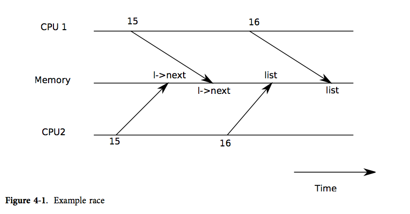

# Lock
## 1. lock的概念
### 1.1 lock的定义
xv6 运行在多处理器上，即计算机上有多个单独执行代码的 CPU。这些 CPU 操作同一片地址空间并分享其中的数据结构；xv6 必须建立一种合作机制防止它们互相干扰。即使是在单个处理器上，xv6 也必须使用某些机制来防止中断处理程序与非中断代码之间互相干扰。xv6 为这两种情况使用了相同的低层概念：锁。<font color=#0000ff>锁提供了互斥功能，保证某个时间点只有一个 CPU 能持有锁。如果 xv6 只能在持有特定的锁时才能使用数据结构，那么就能保证同一时间只有一个 CPU 能使用这个数据结构。这样，我们就称这个锁保护了数据结构。</font>

例如，执行一个链表插入操作：
```
void
insert(int data)
{
    struct list *l;
    l = malloc(sizeof *l);
    l->data = data;
    l->next = list;
    list = l;
}
```
如果两个不同的 CPU 同时执行 insert，可能会两者都运行到倒数第二步，而都未开始运行最后一步。这样的话，就会出现两个链表节点，并且 next 都被设置为 list。当两者都运行了最后一步的赋值后，后运行的一个会覆盖前运行的一个，于是先赋值的一个进程中添加的节点就丢失了。如下图所示：

所以需要加入锁：
```
void
insert(int data)
{
    struct list *l;
       acquire(&listlock);
    l = malloc(sizeof *l);
    l->data = data;
    l->next = list;
    list = l;
       release(&listlock);
}
```

### 1.2 lock的作用
通常锁有三种作用，理解它们可以帮助你更好的理解锁。
- 锁可以避免丢失更新。
- 锁可以打包多个操作，使它们具有原子性。我们之前介绍了加锁解锁之间的区域是critical section，在critical section的所有操作会都会作为一个原子操作执行。
- 锁可以维护共享数据结构的不变性。共享数据结构如果不被任何进程修改的话是会保持不变的。如果某个进程acquire了锁并且做了一些更新操作，共享数据的不变性暂时会被破坏，但是在release锁之后，数据的不变性又恢复了。

## 2. lock的使用
### 2.1 什么时候使用锁
使用锁的一个难点在于要决定使用多少个锁，以及每个锁保护哪些数据、不变量，有几个基本原则：
<font color=#0000ff>
1. 当一个 CPU 正在写一个变量，而同时另一个 CPU 可能读/写该变量时，需要用锁防止两个操作重叠。
2. 当用锁保护不变量时，如果不变量涉及到多个数据结构，通常每个数据结构都需要用一个单独的锁保护起来，这样才能维持不变量。

</font>

### 2.2 内核锁
内核锁：当我们要保护内核的数据结构时，使用一个内核锁（big kernel lock）还是值得的，当进入内核时必须持有该锁，而退出内核时就释放该锁，基本上所有的系统调用都会被这把大锁保护而被序列化。

系统调用会按照这样的流程处理：
一个系统调用获取到了big kernel lock，完成自己的操作，之后释放这个big kernel lock，再返回到用户空间，之后下一个系统调用才能执行。这样的话，如果我们有一个应用程序并行的调用多个系统调用，这些系统调用会串行的执行，因为我们只有一把锁。

所以通常来说，例如XV6的操作系统会有多把锁，这样就能获得某种程度的并发执行。如果两个系统调用使用了两把不同的锁，那么它们就能完全的并行运行。

### 2.3 关于死锁
如果一段代码要使用多个锁，那么必须要注意代码每次运行都要以相同的顺序获得锁，否则就有死锁的危险。

假设某段代码的两条执行路径都需要锁 A 和 B，但路径1获得锁的顺序是 A、B，而路径2获得锁的顺序是 B、A。这样就有能路径1获得了锁 A，而在它继续获得锁 B 之前，路径2获得了锁 B，这样就死锁了。这时两个路径都无法继续执行下去了，因为这时路径1需要锁 B，但锁 B已经在路径2手中了，反之路径2也得不到锁 A。

<font color=#0000ff>为了避免这种死锁，所有的代码路径获得锁的顺序必须相同。避免死锁也是我们把锁作为函数使用规范的一部分的原因：调用者必须以固定顺序调用函数，这样函数才能以相同顺序获得锁。</font>

### 2.4 中断处理程序中的锁
xv6 用锁来防止中断处理程序与另一个 CPU 上运行非中断代码使用同一个数据。例如，时钟中断会增加 ticks， 但可能有另一个 CPU 正在运行 sys_sleep，其中也要使用该变量，锁 tickslock 就能够为该变量实现同步。

另外，中断也可能引起死锁。如果在中断发生前，应用程序持有了锁A，发生中断后，中断程序需要获得锁A，但是它已经被之前的应用程序获得，因此中断程序会一直等待锁A被释放，引起死锁。<font color=#0000ff>为了避免这种情况，当中断处理程序会使用某个锁时，处理器就会不允许中断发生时持有锁，也就是必须等锁释放后才能进入中断，在此之前中断被关闭。（注意，这里的锁专指spin lock，而sleep lock是不需要关闭中断的）</font>


### 2.5 程序的原子性
程序员可以用锁来保使代码具有原子性。所谓原子操作是指不会被线程调度机制打断的操作；这种操作一旦开始，就一直运行到结束，中间不会有任何 context switch（切换到另一个线程）,例如在计算机中，机器码是属于原子操作。

并没有强制说一定要使用锁，锁的使用完全是由程序员决定的。如果你想要一段代码具备原子性，那么其实是由程序员决定是否增加锁的acquire和release。其次，代码不会自动加锁，程序员自己要确定好是否将锁与数据结构关联，并在适当的位置增加锁的acquire和release。

### 2.6 锁与性能
我们想要获得更好的性能，那么我们需要有更多的锁，但是这又使程序设计更加复杂。
通常来说，开发的流程是：
- 先以coarse-grained lock（即内核大锁）开始。
- 再对程序进行测试，来看一下程序是否能使用多核。
- 如果性能可以的话，那么工作就结束了，你对于锁的设计足够好了；如果不可以的话，那意味着锁存在竞争，多个进程会尝试获取同一个锁，因此它们将会序列化的执行，性能也上不去，之后你就需要重构程序。
  
### 2.7 自旋锁（spin lock）和互斥锁（sleep lock）
自旋锁是为实现保护共享资源，解决对某项资源的互斥占用而提出一种锁机制。在任何时刻，最多只能有一个执行单元获得自旋锁。如果自旋锁已经被别的执行单元保持，调用者就一直循环在那里看是否该自旋锁的保持者已经释放了锁。

互斥锁和自旋锁比较类似，它们都是为了解决对某项资源的互斥使用。无但是两者在调度机制上略有不同。对于互斥锁，如果资源已经被占用，资源申请者拿不到sleep lock的话，只能进入睡眠状态，直到被另一个进程释放锁后唤醒为止。

两个锁的特点总结如下：

- 自旋锁：自旋锁 spinlock，是一种通过积极浪费 CPU cycles 来做 busy-looping 来轮询抢占共享数据结构的一种锁；
- 互斥锁：对一些外设而言，持续地监听他是需要暂停 CPU 的，同样地对于软件而言共享资源长时间的使用轮询来说并不是一个好的分配方案，一种良好的机制就是模仿硬件的中断的做法，实现阻塞的等待支援，等 owner 用完了再通知我起床，即为互斥锁 sleeplock，又称睡眠锁。
  
选择锁的建议：

